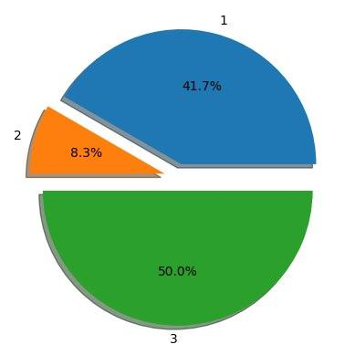
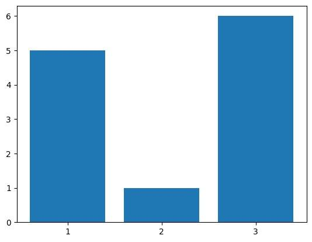
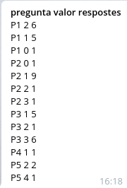

# QuizBot

Bot de Telegram que constesta textualment i gràficament a preguntes relacionades amb enquestes, així com també recullir les respostes que es donen a aquestes.
El projecte també inclou un compilador que interpreta el llenguatge de les enquestes i genera un graf que és el que usa el Bot per interpretar-les.

## Primeres passes

### Prerrequisits

Aquest projecte requereix que python3 i pip estiguin instal·lats a la vostra màquina. Per instal·lar les llibreries de python necessàries correu la següent comanda desde la carpeta arrel del projecte:

```
pip install -r requirements.txt
```

### Execució Compilador

Per executar el compilador simplement executa la següent comanda desde la carpeta /cl

```
python3 test.main.py el_teu_input.txt
```

On *el_teu_input.txt* és el fitxer d'entrada que conté l'enquesta que es vol interpretar.

### Execució Bot

Per fer córrer el bot simplement cal executar la següent comanda desde la carpeta /bot

```
python3 bot.py
```

### Usar el Bot

Obre Telegram i obre un xat amb l'usuari @EnquestaLP_bot [https://t.me/EnquestaLP_bot]. Envia la comanda:

```
/start
```

Si necessites ajuda envia la comanda `/help` al Bot i et mostrarà una llista de comandes disponibles.

## Decisions de disseny

### Compilador

S'han fet una sèrie de suposicions sobre el llenguatge d'enquestes:

* Els identificadors de preguntes, respostes, alternatives, ítems i enquestes no són lliures i tenen un format determinat:
    * Preguntes: Consistirán de una _P_ majúscula i un _número_ qualsevol, per exemple: _P123_
    * Respostes: Consistirán de una _R_ majúscula i un _número_ qualsevol, per exemple: _R123_
    * Alternatives: Consistirán de una _A_ majúscula i un _número_ qualsevol, per exemple: _A123_
    * Items: Consistirán de una _I_ majúscula i un _número_ qualsevol, per exemple: _I123_
    * Enquestes: Consistirán de una _String_ seguida d'un _número_ qualsevol _opcional_, per exemple: _Enquesta123_, _Ahirenquestà_.
* Les opcions de cada resposta estan identificades sempre per números.
* Tornar a usar un identificador amb el mateix nom que un que aparescut abans el sobreescriu.
* Els Strings poden contenir accents.
* Només es pot fer una comanda ENQUESTA per cada execució, per tant, quan l'intèrpret la detecta, acaba.

També s'ha afegit una pregunta addicional quan s'executa amb un input que sobreescrigui un graf d'enquesta que ja existeixi.

### Bot

* Podem tenir moltes enquestes creades pel Compilador, però són totes independents entre elles.
* Definim l'_enquesta activa_ en un moment de l'execució com l'última enquesta (`<idEnquesta>`) de la que s'ha fet `/quiz <idEnquesta>`.
* S'ha incorportat una funcionalitat addicional a `/quiz` tal que si es fa `/quiz <idEnquesta> 0` (es crida un argument addicional igual a _0_), `<idEnquesta>` passa a ser l'_enquesta activa_.
* Les comandes `/bar`, `/pie` i `/report` fan referència a l'_enquesta activa_ en el moment d'executar-se.
* _user_data_ és persistent entre diverses execucions del bot (desde la mateixa màquina) per poder guardar l'estat de l'_enquesta activa_ i començar l'execució del bot podent usar totes les comandes (després de la primera execució).
* Les respostes de cada enquesta es guarden en un diccionari de diccionaris dins _user_data_ que serialitzem cada cop que finalitzem una enquesta i per tant només si s'acaba l'execució de l'enquesta sense errors s'actualitzarán les respostes recollides.

## Tests

### Compilador run

Correu la següent comanda per interpretar amb el compilador l'exemple donat a l'enunciat (input.txt) i crear el graf pertinent que permeti al Bot començar a operar.

```
python3 test.main.py input.txt
```

Es crearà el graf adient i es mostrarà el plot.

### Bot run

Ara que ja tenim una Enquesta creada farem una demo run del bot.

Comencem amb

```
/quiz E
```

Això iniciarà l'enquesta _E_ i el bot anirà fent una sèrie de preguntes i recullint les respostes. Es pot comprovar que detecta errors en les respostes: si introduïm una string qualsevol o un número retornarà un missatge d'error. Es pot comprovar que l'exemple de l'enunciat funciona com cal:

```
E> Quants adults viuen a casa teva?
0: zero
1: un
2: dos
3: més de dos
>> 2
E> Quants menors viuen a casa teva?
0: zero
1: un
2: dos
3: més de dos
>> 1
E> Com vas a la feina majoritàriament?
1: caminant
2: en cotxe
3: en transport públic
>> 3
E> Quin mitja de transport utilitzes majoritàriament?
1: Tren
2: Bus
3: Metro
4: Altres
>> 4
E> Gràcies pel teu temps!
```

Per provar les altres comandes, les gràfiques queden més entenedores si s'usa una enquesta que ja tengui respostes, per a això, seleccionem com a enquesta activa a _EnquestaPlena_ fent `/quiz EnquestaPlena 0` i desde l'ordinador fem `python3 emplenarEnquesta.py` que emplenarà les respostes d'_EnquestaPlena_.

A continuació provem les altres comandes, fem `/pie P3` i obtindrem quelcom com:

<center></center>

Seguidament fent `/bar P3` obtindrem:

<center></center>

Finalment amb `/report` hauriem d'obtenir un resultat similar a:

<center></center>

### Altres tests del bot.

S'ha inclòs una enquesta (_EnquestaDobleAlt_) que permet provar una enquesta amb dues alternatives seguides. Per generar el graf es pot procedir amb `python3 test.main.py inputDoubleAlternative` i després provar al bot amb `/quiz EnquestaDobleAlt`.

### Tests d'estil de codi

Usa `pycodestyle` amb cada fitxer \*.py per comprovar que compleixen els estàndards pep8 (tret de la llargada de línia).


## Autor

Joan Francesc Muntaner González
[joan.francesc.muntaner@est.fib.upc.edu]
